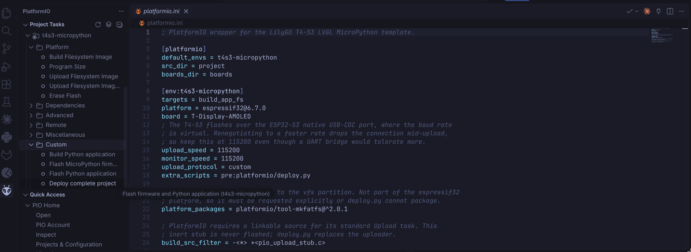

# ESP32-T4-S3-MicroPython-Template

Welcome to the lab using the ESP32-T4-S3 LilyGO!

This repository serves as a foundation for software engineering projects aimed at the ESP32 hardware.
This document will guide you through the setup process and help you prepare to work with your ESP32 hardware.

The supplied firmware already contains MicroPython and LVGL. You write Python;
you do not compile MicroPython, LVGL, or a GUI library.

---

# How to get started

The student workflow works on Windows, Linux, and macOS. The first PlatformIO
setup can take several minutes while tools are installed.

## PlatformIO

1. Install Visual Studio Code
   * Visit [Visual Studio Code's website](https://code.visualstudio.com/download) and download the latest version or use the package manager of your system.
   * Run `Visual Studio Code` and follow the steps.
2. Install the correct extension.
   * Head over to the extensions tab on your left.
   * Search for ["PlatformIO IDE"](https://marketplace.visualstudio.com/items?itemName=platformio.platformio-ide) and install it.


## Linux: serial port access

Windows and macOS need no extra setup. On Linux the board's serial port is
owned by a system group, so PlatformIO cannot open it until you grant access.
Install the PlatformIO udev rules once:

```bash
curl -fsSL https://raw.githubusercontent.com/platformio/platformio-core/develop/platformio/assets/system/99-platformio-udev.rules \
  | sudo tee /etc/udev/rules.d/99-platformio-udev.rules
sudo udevadm control --reload-rules
sudo udevadm trigger
```

Then unplug and reconnect the board. If the port is still unreadable, add
yourself to the group that owns it (`ls -l /dev/ttyACM0` shows which):
`dialout` on Debian/Ubuntu, `uucp` on Arch.

```bash
sudo usermod -aG dialout $USER   # or uucp
```

Log out and back in for the group change to take effect.

## How to run the program

1. Open the locally cloned repository with Visual Studio Code
    * If the "Do you trust the authors of the files in this folder?" dialog appears, click on "Yes, I trust the authors"
2. Open up the file `project/main.py`
3. Connect your ESP32 to your computer via a USB cable.
4. Open the PlatformIO tab in the left sidebar, expand
   **Project Tasks > t4s3-micropython > Custom**, and run **Deploy complete
   project**. This flashes the MicroPython firmware and your Python files in
   one step, and is what the Upload button runs too.

Once the board has firmware on it, **Flash Python application** is faster for
everyday work: it writes only your `project/` files and leaves the firmware
alone.



---

# What to add where

Your code belongs in the `/project` folder. The only place you should add, change, or remove things from is the [**/project**](project/main.py) folder. Changing anything else might break the code and cause a lot of headaches for all involved parties.

## How to connect to Wi-Fi

The T4-S3 has built-in Wi-Fi, but it cannot connect to eduroam. Use another
network or a phone hotspot.

Add or modify the `project/secrets.py` file, then set the SSID
(network name) and password.

```python
WIFI_SSID      = "SSID"
WIFI_PASSWORD  = "PWD"
```

Never commit real credentials to GitHub. `project/secrets.py` is excluded by
the supplied `.gitignore`.

---

# Troubleshooting

## The screen still shows the old interface, and touch does nothing

The board is probably still in upload mode. Tap **RESET/RST once**. 
A retained image on the AMOLED does not mean the application is running.

## Upload cannot connect

1. Stop PlatformIO Monitor with `Ctrl+C`.
2. Disconnect and reconnect the USB cable if the port is locked.
3. Repeat the BOOT/RESET upload-mode sequence.
4. Start Upload again.

On Linux, `Permission denied` on `/dev/ttyACM0` means the udev rules above are
not installed.

## Upload stops at "Stub running... No serial data received"

The board flashes over the ESP32-S3's built-in USB port, where the baud rate is
virtual and cannot be renegotiated. Check that `upload_speed` in
`platformio.ini` is still `115200`; raising it produces exactly this error.

After a failed upload the board may not restart on its own. Press **RESET**
by hand before retrying.

## Upload fails with "Invalid head of packet"

This appears once a Python application is already running on the board: it
prints to the same USB port the uploader needs, and the automatic reset into
upload mode cannot interrupt it. Enter upload mode by hand instead.

1. Hold **BOOT**.
2. Tap **RESET**.
3. Release **BOOT**.
4. Start the upload task immediately.

The board stays in upload mode afterwards, so press **RESET** once when the
upload finishes to start your application.

Close PlatformIO Monitor first if it is running; anything else holding the
serial port causes the same error.

## The screen is black

Open PlatformIO Monitor after resetting. Startup errors are printed at 115200
baud and also stored as `/debug.log` on the device.


## LilyGo tutorial

Visit LilyGO [link](https://github.com/Xinyuan-LilyGO/LilyGo-AMOLED-Series)
